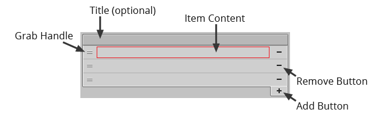

# Control Interface

The reorderable list field interface is intentionally simple with an optional title above.
Support is provided for absolute positioning (`GUI`) and also for automatic layout
(`GUILayout`).

- **Title** - Can be optionally added using `ReorderableListGUI.Title` accepting either a
  string or `GUIContent` instance.

- **Grab Handle** - Use left mouse button to begin dragging item. Drag operation can be
  cancelled by pressing the escape key or the right mouse button. Grab handle is primarily
  for decoration since users can also drag non-interactive areas of an item.

- **Item Content** - Presented using an item drawer or custom property drawer. Content
  position is inset slightly providing a comfortable gap between items.

- **Remove Button** - Click to remove list item. Item removal can be disabled for the
  entire control or on a per item basis.

- **Add Button** - Append blank element to end of list. Item insertion can be disabled.

- **Context Menu** - Additional commands can be shown by right-clicking on non-interactive
  areas of a list item. Context menu can be disabled or customized if needed.

Refer to `ReorderableListFlags` to learn about customizations which can be applied easily.
